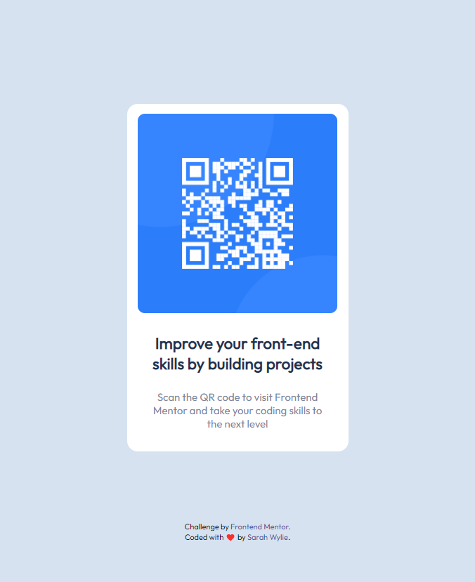

# Frontend Mentor - QR code component solution

This is a solution to the [QR code component challenge on Frontend Mentor](https://www.frontendmentor.io/challenges/qr-code-component-iux_sIO_H). Frontend Mentor challenges help you improve your coding skills by building realistic projects.

## Table of contents

- [Overview](#overview)
  - [Screenshot](#screenshot)
  - [Links](#links)
- [My process](#my-process)
  - [Built with](#built-with)
  - [What I learned](#what-i-learned)
  - [Continued development](#continued-development)
- [Author](#author)

## Overview

This is a simple site that directs you to Frontend Mentor. Scan the code or click the scanner to access the site!

### Screenshot

### Links

- Solution URL: [QRCode GitHub repo](https://github.com/sarahwylie/QRCode)
- Live Site URL: [QRCode](https://sarahwylie.github.io/QRCode/)

## My process

After carefully reviewing the image, and moved the style-guide properties into place and laid out the simple HTML. Once that was complete, I played with the CSS until the product appeared to match the guidelines. I like to add a touch of fun, so I put some pops in there that would still comply to the guidelines. All of this was accomplished in roughly one hour.

### Built with

- Semantic HTML5 markup
- CSS custom properties
- Flexbox
- Mobile-first workflow

### What I learned

I learned that I'm the type of person who likes to reference my existing work, even for simple code, and that's OK!

### Continued development

I'm not always comfortable with mobile and screen-size responsiveness. This takes a lot for me to admit because I pride myself on making accessible sites. I'm always striving to learn and grow!

## Author

- Website - [Sarah Wylie](https://sarahwylie.github.io/hello-wylie/)
- Frontend Mentor - [@sarahwylie](https://www.frontendmentor.io/profile/sarahwylie)
- Insta - [@moolovesdonuts](https://www.instagram.com/moolovesdonuts/)
